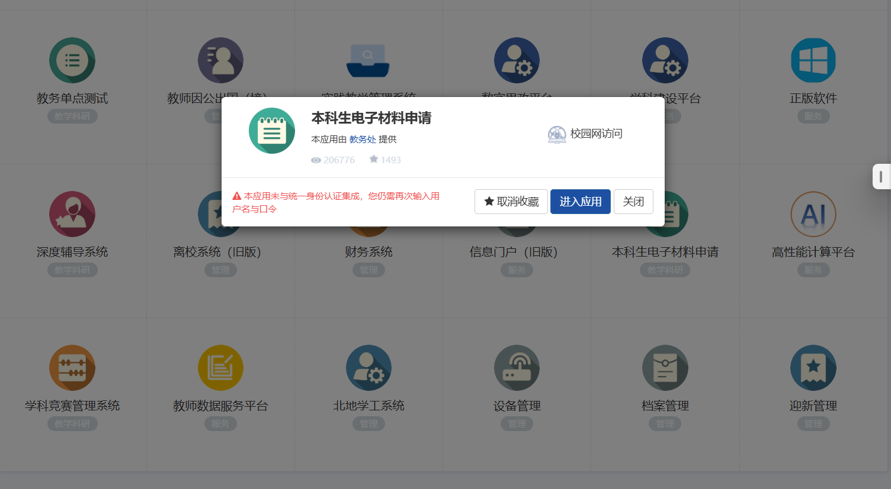

# 以我转信息工程的人工智能专业为例子（大部分问题可以来这里看）

首先在大一你可以准备你想转专业的大部分课程学习（尤其是大一的课程）

### 首先我们先来看通知：

#### 在这里，首先我们要在5.6日前填写这个审批表：

在这里我们院的要求是除了签字和日期都是电子书写打印两份。建议直接问导员具体要求是什么。

学习原因建议多写一点，比如说我们院在我拿表的时候无意间发现（每个转出的人老师都会仔细研究的，你如果写的好一点不仅方便转出学院知道你是铁了心想要转出，也能让转入学院的老师直观的了解你，听说一些院的老师就会仔细看这里的原因）

同时，如果知道你要转出，学院可能会给你开动员会，像我们这里就开了两次动员会（劝说你不要转）但是不会很强硬的，一般就是老师会和你分析老师认为的利弊。

同时如果转出的人数比较多，可能转出的老师就不会给你盖章！（据说我们院的某个专业就是只有前五绩点的才能转）

#### 6-11号

似乎就是老师劝说你留在本专业 没啥了

#### 12-14号

在这里 有的院会给你交的表比较早，12号左右，有的会可能13号 建议多催几次 毕竟是自己要转 。

转专业审批表就是盖过公章的那两份  接下来说怎么拿成绩单：

在信息门户：

（这里似乎我用的edge浏览器不行，所以我得用chrome，我也不知道是不是我的原因 同时多试几次 大家都是这样 需要多试几次才能打开 真的很诡异)

点进去后可能是404 没事再多点几次 同样的问题。

就是学号 密码身份证号

选择这个就行 然后彩打。

至于个人自述 也是好好写 那个老师似乎就瞟一眼这个...

因为这里信息工程要提交电子版的两份东西（包括邮箱 所以会用邮箱）像我们就是十六号中午左右接收到邮箱通知说多会转专业面试（一般来说应该是一天半到两天的准备时间，但由于正好到了周六日，你懂的，只能选择在了周一）

在这里我们可以看到2023年的信息工程院的通知，当然，你应该掌握的其实和你所想转专业大一所学的内容差不多的话，那我觉得你面试应该问题不大。