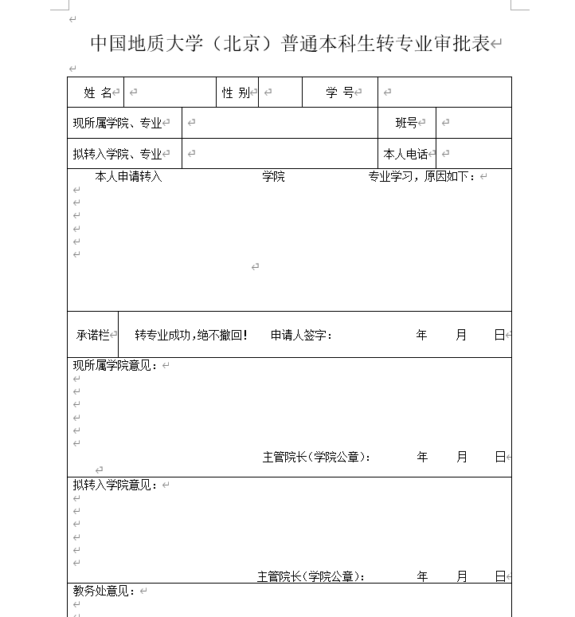
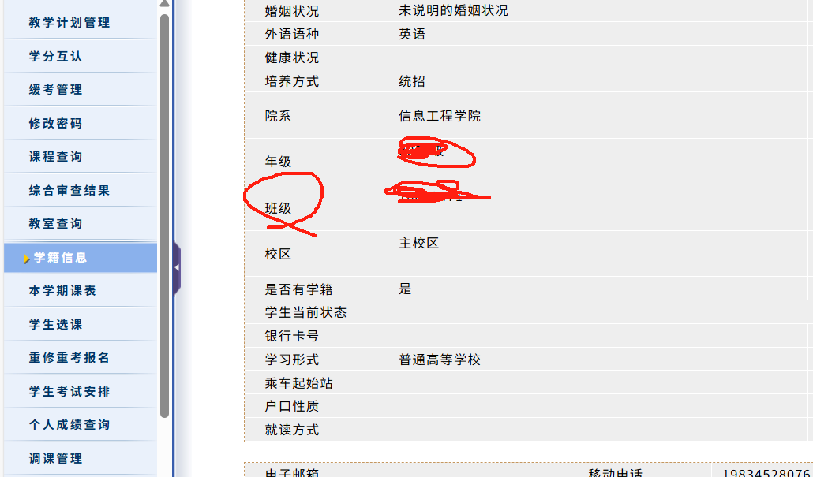

# 以我转信息工程的人工智能专业为例子（大部分问题可以来这里看）

### 转专业之前的准备

大一上成绩 最好在3.6以上

其实提前一个月准备就可以了 从预习到结束 我无机化学和工程图学都是期末冲刺学的 平时根本没有学。

大一下看你是否需要绩点。不需要的话不挂科就行（应该是有要求不允许挂科，转专业的） 提前两周准备吧 

同时参加一些竞赛（计算机类的 因为填表的时候是有你在校获得什么奖项的）

同时自学一些课程计算机内的 尤其注意大一信工学习的专业课 专业课内容是会提问的。

至于其他专业 难度就很低 绩点最好在3以上 基本问题就不大 稍微了解一点本专业内容

##  转专业的流程

### 首先我们先来看通知：

#### 在这里，首先我们要在5.6日前填写这个审批表：

在这里我们院的要求是除了签字和日期都是电子书写打印两份。建议直接问导员具体要求是什么。

学习原因建议多写一点，比如说我们院在我拿表的时候无意间发现（每个转出的人老师都会仔细研究的，你如果写的好一点不仅方便转出学院知道你是铁了心想要转出，也能让转入学院的老师直观的了解你，听说一些院的老师就会仔细看这里的原因）

同时，如果知道你要转出，学院可能会给你开动员会，像我们这里就开了两次动员会（劝说你不要转）但是不会很强硬的，一般就是老师会和你分析老师认为的利弊。

同时如果转出的人数比较多，可能转出的老师就不会给你盖章！（据说我们院的某个专业就是只有前五绩点的才能转）

此外一定要主动点自己交表 我认识一个很优秀的想转数理的 结果表没拿（以为导员会给自己交给对方学院 直接就没有机会了 ）

一定要多问 有可能流程晚了就一定要问。

#### 6-11号

似乎就是老师劝说你留在本专业 没啥了

#### 12-14号

在这里 有的院会给你交的表比较早，12号左右，有的会可能13号 建议多催几次 毕竟是自己要转 。

转专业审批表就是盖过公章的那两份  接下来说怎么拿成绩单：

在信息门户：

（这里似乎我用的edge浏览器不行，所以我得用chrome，我也不知道是不是我的原因 同时多试几次 大家都是这样 需要多试几次才能打开 真的很诡异)

点进去后可能是404 没事再多点几次 同样的问题。

就是学号 密码身份证号

选择这个就行 然后彩打。

至于个人自述 也是好好写 那个老师似乎就瞟一眼这个...

因为这里信息工程要提交电子版的两份东西（包括邮箱 所以会用邮箱）像我们就是十六号中午左右接收到邮箱通知说多会转专业面试（一般来说应该是一天半到两天的准备时间，但由于正好到了周六日，你懂的，只能选择在了周一）

在这里我们可以看到2023年的信息工程院的通知，当然，你应该掌握的其实和你所想转专业大一所学的内容差不多的话，那我觉得你面试应该问题不大。

### 面试

一般一到两天会收到

我们到时候到场的是三个人（一个人工智能，两个大数据 都是我们院的）

具体面试内容：

我忘了似乎是六个老师：

1.一个负责给你签到的老师

2.一个问你面试题的老师（三道面试题：

我回忆的的是：

 int a=23；

 正确的是 int*p=&a；

 a=11 a+=a*4；

 sizeof作用

另一个人似乎问了函数指针数组指针等等

另一个是抽到一个很基础的定义吧，一个int，然后还有一个switch

3.应该是学院的比较资深的人

问的问题很随意

甚至问我工程图学的问题？ 问我虚函数我没回答上来....

问我高考成绩 我说我没记住（因为雀氏没记住，数学和物理吧）

反正权力比较大

4.应该是班主任

问我学过人工智能的啥没有

我很惭愧的说没有..因为我不敢再让他搞了...再问我不就彻底废物了，万一没回答上来...直接说没学..

5.导员

问你有没有参加过什么工作活动 因为我不是团员 所以没啥活动..

各种问你你跟不上怎么办 说你这绩点不能保研怎么办

反正压力面吧..可能也和这位导员比较久远的风评有关。

似乎后面就是压力面 说你跟不上进度怎么办 反正可能是惯用问题 人机回答..

最后导员特意强调让我谢谢老师..

### 心理面试

在隔两三天 会有一个心理测试（当时心理测试是有28个人我记得 但是最后转成功只有20个人 我不知道是不是心理测试卡住了）

以往是自己带电脑做题 今年采用书面形式 需要带一根笔做卷子

题目是高领人才这类的（第一类为MMPI明尼苏达多相人格检测的部分题目 第二类问你创新创业能力 挺水的 第三题是房树人测验）

### 等待通知

按理来说是5.28之前接受到通知 但是因为某些大家都可以猜测的原因 实际上我们是5.29 也就是公示期结束后才知道自己转没转成。

这段时间没有任何通知。

唯一查看自己有没有成功的方法就是查看教务管理系统自己的教学计划是否变化

同时在这里看自己转后的班级  要是你认识班长可以直接加一下微信哈哈

### 考试之后

等期末考试后 导员打电话联系了我 并让我加了导员和班长微信

通知小学期计划

我的小学期：

因为我选择了ACM队 所以替换了信工小学期 

同时给ACM队打个广告吧 算法目前面试和机考（一些考研）都挺重要的 稍微花点时间还是比较值当的。