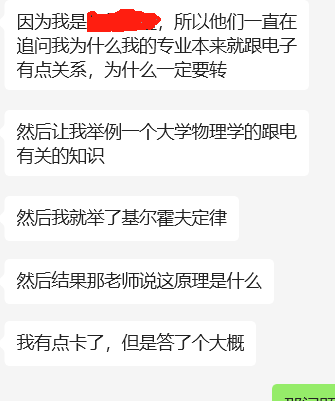
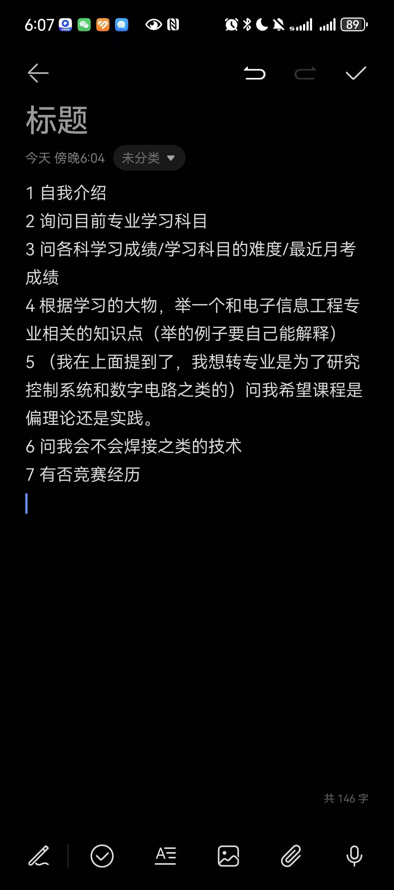

### 电子信息

有很多院内转的

电子和电气有16个（电气应该有七八个。）

问你最近一些考试考得怎么样

 辅导员问我有没有打过竞赛

就问我自学的话是什么材料，什么网课

喜欢未来课程是偏实践还是偏理论

审核似乎不是电子的老师（PS：可能是因为我说我对这个专业有点了解吧，然后就没什么要问我的 因为他们不是本专业的，他们可能也不知道是什么

注意如果：同学说有一个面试特别久，好像是在讲团委交接的问题

担任了班级团支书之类的就会问到这个问题
