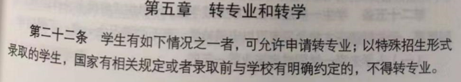
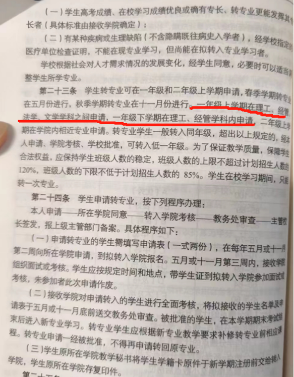

## 常见问题

我在这里说一些我了解的规则： 主要以大一下为主体 （我个人可能也会有错误 所以就凑乎看看）

转专业规则：

怎么看转专业的相关流程？搜索中国地质大学北京教务处官网，查找相关年份转专业的相关细则。根据往年时间推测今年时间。同时关注学院官网（eg：中国地质大学北京信息工程学院，在学院官网上也会有相关通知，但是似乎只有信息工程学院会有）

此外说一下我了解的一些情况：

文转理一般会问第一次高数成绩（我认识的一位经济学的高数成绩比较低很明显老师就不满意，听说需要竞赛得奖？我也不清楚，同时听说经济类似乎只能转一次，无论成功与否，假如不成功那么以后就没有转的机会了？）我本人是理工院的，这些我不太清楚，建议询问相关专业学长学姐。

对于地大的某些专业 可以搜索中国地质大学北京本科生培养方案，在教务处有相关培养方案，确认课程是否是自己感兴趣的/是否是你理解的相关专业。

Q：转专业后第一次接触是在什么时候？

A：大一结束后的小学期实习 如果像某些学院没有实习 那么就是大二开课后

Q：成功转专业后，如何和老师联系？

A：如果可以 你可以提前加导员/班长微信 一般是等期末考完后 可能会有导员会给你打电话 加你微信/ 班长把你拉到班级通知群/就是这样。反正肯定会通知的 不过建议是提前加比较好。

Q：大二降转难度如何？

A：我不清楚。听学长说比较难。参加并获得了一些奖项 反正今年信工只有一位降转的。

Q：转专业之后的非相关的课程会看保研绩点吗？

A：看不同专业。问相应的学院秘书。信工和材料似乎就是看的 但是工院就不看地球科学概论的绩点？ 信工是会把所有的转化为选修的绩点。所以建议问清楚

Q：可以第二学期挂科吗？

A：看学院要求。一般不允许 如果挂科后 学院会辞退你到原有学院。建议最后两周冲刺一下。
